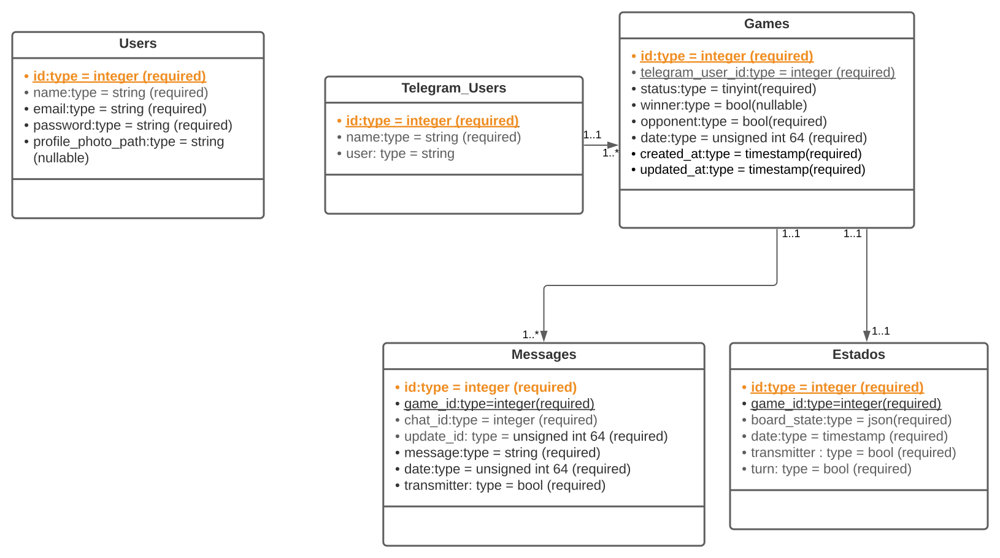

# Diseño de la Base de Datos

Aurocat fue un proyecto con el objetivo de Desarrollar una plataforma Web desde la cual se pudiera gestionar las conversaciones de un chatbot de Telegram. El proyecto fue construido bajo el framework de Laravel, con una base de datos hecha con MySQL y con Vue JS como parte del diseño.  Se trabajo bajo el marco de trabajo de SCRUM, para el manejo de versiones se utilizo GIT y la plataforma de GitHub lo que nos permitió una dinámica de trabajo más colaborativa.

- Uso de la [API de Telegram](https://core.telegram.org/).

- Interfaz moderna con [Inertia](https://inertiajs.com/).

- [Pusher](https://pusher.com/) para una experiencia en tiempo real.

- Uso de Jetstream para la autenticación de [Fortify](https://laravel.com/docs/8.x/fortify).

- Uso de [Eloquent](https://laravel.com/docs/8.x/eloquent) para interactuar con la base de datos.

##  Diagramas
---

El primer paso en el diseño de la base de datos fue analizar los datos que se recolectarían y determinar el uso que se les daría.

Para mayor consistencia, cada grupo de datos se define como un grupo de tablas y de datos relacionados. Cada una de ellas sirve a un propósito en específico para recabar información de los usuarios que interactúan con nuestra aplicación, las partidas o juegos que se han realizado a través de Telegram.

Al ser una aplicación altamente interactiva durante el diseño también nos importaba recabar información de los mensajes que entre usuarios y agentes pudieran compartir, principalmente para uso estadístico que podrá estar disponible dentro del dashboard de la misma ampliación.

Como parte inicial del proceso de construcción de una base de datos se empezó por la creación del diagrama Entidad-Relación con los principales agentes que estarían interactuando dentro de la aplicación, su relación y los campos preliminares que se utilizarían en el diseño final.

Se definieron un total de cinco entidades para este proyecto cada una corresponde a un actor que interactúa con nuestra aplicación:

- <b>Telegram_users:</b> corresponde al usuario de Telegram, es decir a cualquier persona con una cuenta activa dentro de la aplicación.

- <b>Users:</b> En esta entidad podemos encontrar a los “agentes” que estarán interactuando con los usuarios en la interfaz de la aplicación web.

- <b>Games:</b> Esta entidad describe y almacena los datos relacionados con el juego, que es la principal interacción por parte de nuestra aplicación.

- <b>States:</b> La entidad de estados nos permite conocer el estatus actual de un juego, para saber si un usuario esta interactuando con el bot o con un agente dentro de la plataforma.

- <b>Messages:</b> Como una interacción adicional nuestros usuarios podrán enviar mensajes a través de la aplicación mismos que se verán reflejados en la plataforma web, esta entidad nos permite acceder y almacenar cada uno de ellos para tener un mayor control sobre el historial de la conversación.

## Tablas
---

Una vez hecho y aprobado el análisis preliminar de lo que sería nuestra base de datos, pasamos a la transformación del diagrama entidad relación en un esquema de tablas, que nos permitirá definir, relaciones y tipos de datos que se utilizarían para almacenar la información correspondiente a nuestra aplicación

 

 

Estas tablas contienen y especifican los campos que formaran parte de nuestros registros, su extensión y tipo de relacionado como se logra visualizar.

## Modelos
---
📱 **TelegramUser:** Este objeto representa un usuario de Telegram.

| Campo |  Tipo | Descripción |
| ------| ----- | ----------- | 
| id    | unsignedBigInteger  | Identificador único para el usuario de Telegram |
| name    | String  | Nombre del usuario de Telegram |

🎮 **Game:** Este objeto representa un juego.

| Campo |  Tipo | Descripción |
| ------| ----- | ----------- | 
| id    | unsignedBigInteger  | Identificador único del juego |
| telegram_user_id    | unsignedBigInteger  | Identificador foráneo del usuario de Telegram |
| state | tinyInteger | Representa el estado del juego(bot, agente, finalizado)|
| winner | tinyInteger |Representa el ganador del juego
| opponent | tinyInteger | Representa al contrincante con el que se está jugando |
| date | unsignedInteger | Fecha en que se creó el juego en hora Unix|

📝 **State:** Este objeto representa el estado de un juego.

| Campo |  Tipo | Descripción |
| ------| ----- | ----------- | 
| id    | unsignedBigInteger  | Identificador único para el estado del juego |
| game_id | unsignedBigInteger  | Identificador foráneo del juego |
| board_state | text  | Representación del estado del juego en formato JSON |
| transmitter | tinyInteger | Representa al jugador que hizo el movimiento |
| turn | tinyInteger | Representa el turno del siguiente jugador |
| date | unsignedInteger | Última fecha de modificación del estado en hora Unix|

💬 **Message:** Este objeto representa un mensaje.

| Campo |  Tipo | Descripción |
| ------| ----- | ----------- | 
| id    | unsignedBigInteger  | Identificador único para el mensaje |
| game_id | unsignedBigInteger  | Identificador foráneo del juego |
| chat_id | integer  | Identificador único del usuario de Telegram |
| update_id | unsignedInteger | Identificador único de la actualización del mensaje|
| message | text | Mensaje entrante de tipo: texto, emoji y sticker |
| transmitter | tinyInteger | Representa al emisor del mensaje |
| date | unsignedInteger | Fecha del envío del estado en hora Unix|

## Estados 
---
**STATE**: Representa el estado del juego (bot, agente, finalizado)
| Estado | Representación |
| ------ | ------ |
| 0 |  Bot | 
| 1 | Agente |
| 2 | Finalizado |

**WINNER**: Representa al ganador
| Estado | Representación |
| ------ | ------ |
| 0 |  Bot / Agente | 
| 1 | Telegram_user |

**OPONENT**: Representa al contrincante 
| Estado | Representación |
| ------ | ------ |
| 0 |  Bot | 
| 1 | Agente |

**TRANSMITTER**: Representa al emisor del mensaje
| Estado | Representación |
| ------ | ------ |
| 0 |  Bot | 
| 1 | Agente |

## Conexión a la BD
---

Como se especifica en la figura para configurar la conexión a la Base de Datos, se deben configurar ciertos parámetros para obtener una conexión exitosa.

| parámetro | concepto |
| ------ | ------ | 
| DB_CONNECTION| Este parámetro identifica el tipo de conexión de la base de datos. |
| DB_HOST| Servidor donde se encuentra alojada la base de datos |
| DB_PORT | El puerto por donde es posible la conexión |
| DB_DATABASE| El nombre dado a la base de datos |
|DB_USER| El nombre de usuario del SGBD |
| DB_PASSWORD | La contraseña del SGBD |
