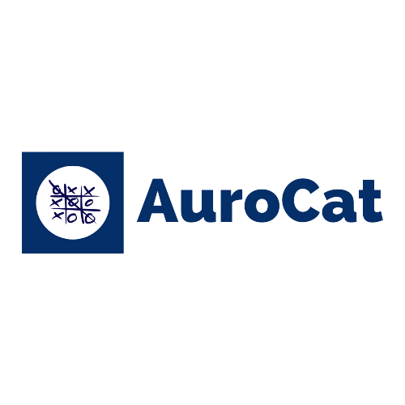

## **Sobre AuroCat**
---
AuroCat es una aplicación web para gestionar conversaciones de un chatbot de Telegram desarollada en Laravel.

- Uso de la [API de Telegram](https://core.telegram.org).
- Interfaz moderna con [Inertia](https://inertiajs.com/).
- [Pusher](https://pusher.com/) para una experiencia en tiempo real.
- Uso de Jetstream para la autenticación de [Fortify](https://laravel.com/docs/8.x/fortify).
- Uso de [Eloquent](https://laravel.com/docs/8.x/eloquent) para interactuar con la base de datos.

## **Documentación**
---
AuroCat tiene una documentación[documentación](Documentation/DOC.md) que te permite entender con facilidad su funcionamiento. 

## **Usa este proyecto**
---
1. Clona este repositorio con git.
2. Instala dependencias ejecutando `npm install` y `composer install` dentro del directorio que clonó (probablemente `InternAuro`).
3. Compile sus archivos ejecutando `npm run dev`.
4. Inicie el servidor de desarrollo con `php artisan serve`.
5. Abra el sitio de desarrollo yendo a `http://localhost:8000` en su navegador.

## **Conoce más**
---
AuroCat tiene un [documento](https://docs.google.com/document/d/1kcoQ_oWIf-p8IpjZMLlYjXl2TUNSo0JWUsnTUBQbums/edit?usp=sharing) sobre el proyecto en general.

El [catálogo de querys](./database/database.md) muestra el flujo del proyecto que se lleva desde la base de datos.

## **Autores**
---
Todas las personas que aportaron en este proyecto.

  

